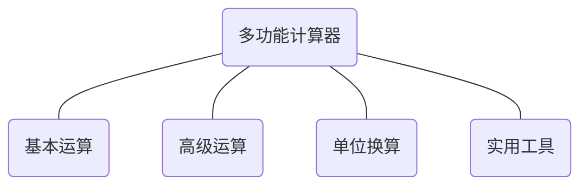
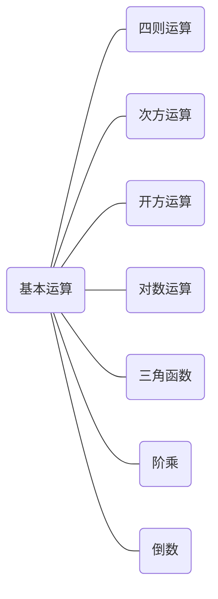
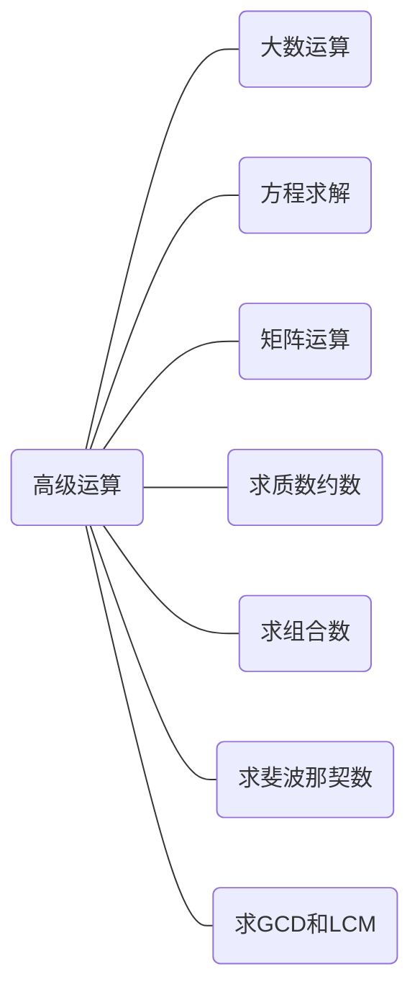
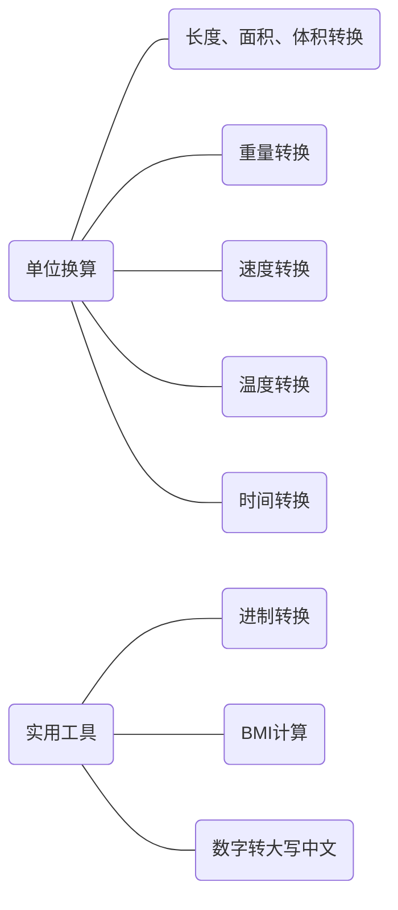
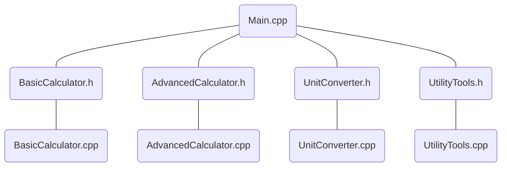

**南航C++课设**
**多功能计算器**

```mermaid
graph TD
A(多功能计算器)---B1(基本运算)
A---B2(高级运算)
A---B3(单位换算)
A---B4(实用工具)
```

```mermaid
graph LR
B1(基本运算)---C1(四则运算)
B1---C2(次方运算)
B1---C3(开方运算)
B1---C4(对数运算)
B1---C5(三角函数)
B1---C6(阶乘)
B1---C7(倒数)

```

```mermaid
graph LR
B2(高级运算)---D1(大数运算)
B2---D2(方程求解)
B2---D3(矩阵运算)
B2---D4(求质数约数)
B2---D6(求组合数)
B2---D7(求斐波那契数)
B2---D8(求GCD和LCM)
```

```mermaid
graph LR
B3(单位换算)---E1(长度、面积、体积转换)
B3---E2(重量转换)
B3---E5(速度转换)
B3---E6(温度转换)
B3---E7(时间转换)
B4(实用工具)---F1(进制转换)
B4---F2(BMI计算)
B4---F3(数字转大写中文)
```

```mermaid
graph TD
A(Main.cpp)---B(BasicCalculator.h)---B2(BasicCalculator.cpp)
A---C(AdvancedCalculator.h)---C2(AdvancedCalculator.cpp)
A---D(UnitConverter.h)---D2(UnitConverter.cpp)
A---E(UtilityTools.h)---E2(UtilityTools.cpp)
```

